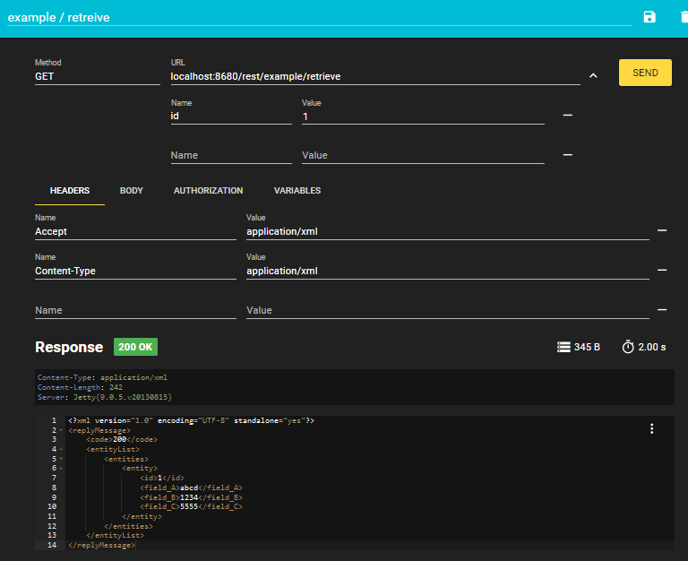
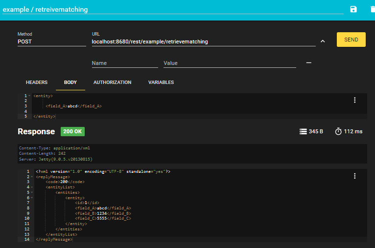

## Tomcat Web App

Run this application in Jetty within Netbeans

## Web UI

The application should be available at http://localhost:8084/


## ReST

Two rest endpoints are provided in the example.

```
retreive allows you to retreive a specific entity

GET http://localhost:8680/rest/example/retrieve

retrievematching allows you to search for an entity using a template

POST http://localhost:8680/rest/example/retrievematching
```
These end points are implimented by the class 
[ExampleProjectRestImpl.java](../web/src/java/org/solent/com504/tca2019/web/rest/ExampleProjectRestImpl.java)

You can do experiments with these ReST endpoints by installing the Firefox or chrome RESTer plugin
https://addons.mozilla.org/en-US/firefox/addon/rester/

RESTer allows you to create GET or POST requests and to change the request headers to change between an XML response or JSON reponse.

You can import example rest requests for this app to rester (or postman) from

[rester-export-postman.json](../web/rester-postman/rester-export-postman.json)

The example/retrieve shows how to request a single entiry using GET



The example/retrievematching shows how to search for entities using POST and an entityTemplate



